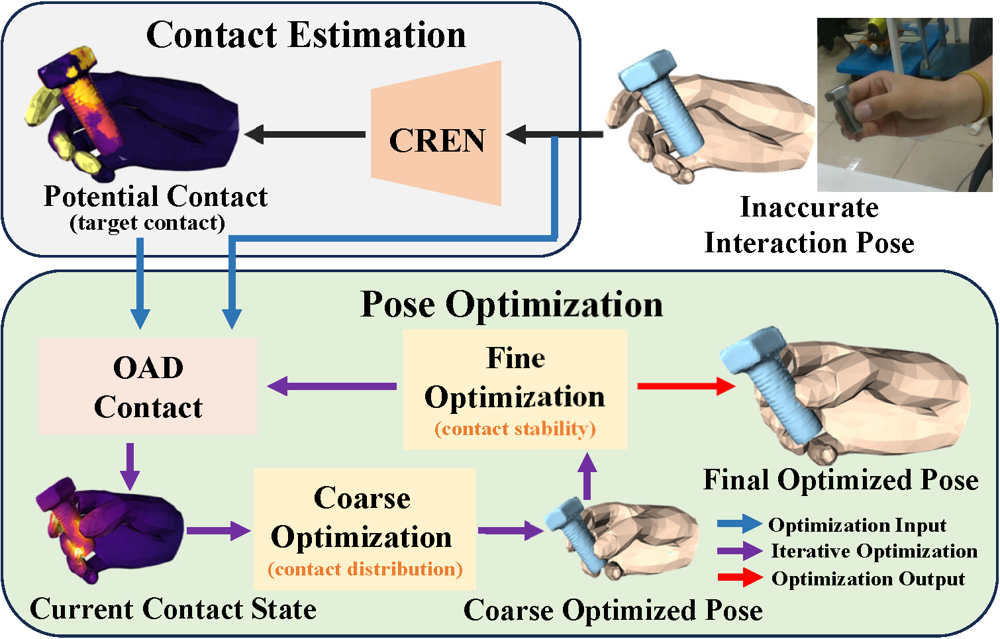

# HOContactopt



## Installation

### Environment Setup

We first create a new conda environment.
```
conda create -n hocopt python=3.8
conda activate hocopt
``` 

Note Python version ≥3.8 should be applicable. We tested that Python=3.9 is also suitable
for our project.

### Install Pytorch and Pytorch3d

Choose the corresponding pytorch version to install according to your cuda version.

```bash
pip install torch==1.12.1+cu116 torchvision==0.13.1+cu116 torchaudio==0.12.1 --extra-index-url https://download.pytorch.org/whl/cu116
```

We recommend using source code to install Pytorch3d.

```
git clone https://github.com/facebookresearch/pytorch3d.git
cd pytorch3d && pip install -e .
```

### Install other dependencies

We recommend installing these packages using .whl file.

The version in brackets is the reference version in our environment. You need to adjust the version according to your configurations.
Different versions can be referred to [whl-sites](https://data.pyg.org/whl/).

```
torch-cluster (1.6.0+pt112cu116)
torch-scatter (2.0.9)
torch-sparse (0.6.16+pt112cu116)
torch-spline-conv (1.2.1+pt112cu116)
pyg-lib (0.1.0+pt112cu116)
```

Other dependencies play nicely with pip and can be installed with:

```bash
pip install git+https://github.com/hassony2/manopth.git open3d tensorboardX pyquaternion trimesh transforms3d chumpy opencv-python
```

#### Download MANO Model
Download the Python 3-compatible MANO code from the [manopth website](https://github.com/hassony2/manopth). Copy the `mano` folder from the manopth project to the root of the ContactOpt folder.

Due to license restrictions, the MANO data files must be downloaded from the original [project website](https://mano.is.tue.mpg.de/). Create an account and download 'Models & Code'. Extract the `models` folder to the recently created `mano` directory. The directory structure should be arranged so the following files can be found:
```
mano/webuser/lbs.py
mano/models/MANO_RIGHT.pkl
```

## Running On Datasets

To run HOCOpt on datasets, download the preprocessed datasets
and pretrained checkpoints at the [website](https://huggingface.co/barrycxg/hocopt_datasets).

```bash
python hocopt/run_hocopt.py --split=SELECT_CLASS --checkpoint=PATH-TO-MODEL
```

The visualization of optimization results.

```bash
python hocopt/run_eval.py --split=SELECT_CLASS --vis
```
SELECT_CLASS=[handoff, fine, im_dexycb, im_ho3d]

## Acknowledgements
This repo is built based on [Contactopt](https://github.com/facebookresearch/ContactOpt) and [CHOI](https://github.com/JunxingHu/CHOI). We sincerely appreciate their contributions to open source.